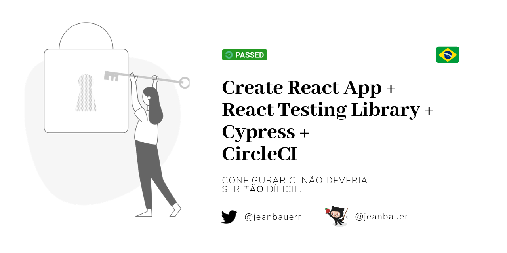

# Create React App + React Testing Library + Cypress com Circle CI
> Este é um repositório que demonstra a configuração mínima para ter uma aplicação instalada e com integração contínua usando o Circle CI, com teste unitário, integração e e2e.

<p align="center">
  
</p>

Olá 👋, este repositório apresenta uma configuração mínima para ter uma aplicação React com o Circle CI.

Você pode ir em frente e clonar este repositório ou implementar facilmente em seu próprio código com [3 commits](https://github.com/jeanbauer/cra-rtl-cypress-circleci/commits/master):

## 1. Adicione React Testing Library
> RTL é uma das minhas bibliotecas favoritas, faz escrever testes tão natural quanto escrever código.
`yarn add @testing-library/react @testing-library/jest-dom -D`

Crie um arquivo chamado setupTests.js assim: ./src/setupTests.js:
```js
// this adds jest-dom's custom assertions
import '@testing-library/jest-dom/extend-expect'
```

Vá em frente e escreva seu primeiro teste: _./src/app.spec.js_
```js
import React from 'react'
import { render } from '@testing-library/react'
import App from './App'

describe('App', () => {
  it('renders content', () => {
    const { getByText } = render(<App />)
    const content = getByText('Hello world')
    expect(content).toBeInTheDocument()
  })
})
```

Fizemos o mínimo com React Testing Library, veja mais exemplos aqui:
- Se você quiser ver mais exemplos para iniciantes: [link](https://testing-library.com/docs/react-testing-library/example-intro)
- Casos mais específicos, como react-redux: [link](https://github.com/kentcdodds/react-testing-library-examples/tree/master/src/__tests__)


## 2. Adicione Cypress
Primeiro adicione Cypress ao seu projeto: `yarn add cypress -D`

Agora crie a estrutura inicial da pasta cypress:
Crie uma pasta chamada _cypress_ e, dentro dela, outra chamada _integration_.

Em seguida, crie seu primeiro teste e2e: _./cypress/integration/app.spec.js_
```javascript
describe('App', () => {
  it('check if app is rendering a welcome message', () => {
    cy.visit('http://localhost:3000')

    cy.get('.App').contains('Hello world')
  })
})
```

Este é um exemplo muito simples do que você pode criar com o Cypress, eu sei que provavelmente não fez seus olho brilharem, mas as coisas podem ficar realmente empolgantes com esses plugins que você pode adicionar aos seus scripts:
- 📷Teste de Regressão Visual: https://github.com/palmerhq/cypress-image-snapshot
- ♿Melhore a acessibilidade do seu código: https://github.com/avanslaars/cypress-axe
- 🤯Escreva testes unitários com Cypress: https://github.com/bahmutov/cypress-react-unit-test
- E [muito](https://docs.cypress.io/plugins/index.html) mais

## 3. Adicione Circle CI
Crie uma pasta como: _./.circleci_ e um arquivo chamado _./.circleci/config.yml_

O conteúdo de config.yml deve ser:
```yml
version: 2.1
orbs:
  cypress: cypress-io/cypress@1
  react: thefrontside/react@0.1.0
workflows:
  push:
    jobs:
      - react/install
      - react/test:
          requires:
            - react/install
  build:
    jobs:
      - cypress/run:
          yarn: true
          start: yarn start
          wait-on: 'http://localhost:3000'
          no-workspace: true
```

Isso é tudo sobre a parte do código, agora siga o tutorial do Circle CI para criar uma conta e adicionar seu projeto: [link](https://circleci.com/docs/2.0/project-build/)

## 4. (Optional) Adicione uma 'Badge'

Quer mostrar a todos que você fez isso? Veja [aqui](https://circleci.com/docs/2.0/status-badges/#steps) como adicionar uma badge do Circle CI para seu repositório.

<p align="center">
  <a href="https://circleci.com/gh/jeanbauer/cra-rtl-cypress-circleci/tree/master" title="Badge do CircleCI mostrando que os testes estão passando">
    
  </a>
</p>

## É isso

É isso, se você tiver alguma sugestão para melhorar este exemplo, sinta-se à vontade para abrir uma issue ou falar comigo.

Espero que ajude. _Happy testing!_ 👋
